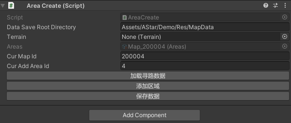

# A*多线程寻路方案
#### 支持分区域寻路

#### 支持不同寻路单位大小寻路

#### 支持寻路网格自定义编辑和生成
#### 支持单位碰撞处理

## 使用方法
### 1.创建寻路网格
#### 1.1.创建地图
创建一个空物体，添加AreaCreate组件,设置要保存数据的路径，添加自定义的地图Id，点击加载寻路数据，会在指定路径下生成一个地图数据文件，文件名为Map_Id.
如果改目录下已经有同名文件那么会加载对应数据而不是新创建。如果填入的目录不存在会制动创建到Assets目录下。  

#### 1.2.创建区域
填入CurAreaId，点击添加区域，会生成一个对应id区域子物体。  
  
X,Y:地图的宽高.  
XGridNum:X轴上的格子数(Y轴归根据X的数量进行自定义计算)  
ConnectArea:要连接的区域，会根据当前区域连接的区域，再保存时自动计算拼接线，比如下图3号区域连接2号区域和一号区域。区域连接主要用于连接两个区域互通.  
**注意：区域互联不能相互连，3连了1，1就不要连3了。**  
  
MaxHeight,MinHeight:主要用于（再有地形的情况下）适配地形高度再高度范围内可走。目前项目还没用到。  
FastLine: 主要用于快速编辑一部分格子（变成走或变成不可走）如下图连续点击左下和右上的格子可以使一整块都变成不可走，反过来就变成可走。  
  
IsCityEditor：主要用于运行时找到的标记的可编辑区域，比如某些项目中的自定义编辑区域，后面的两个参数是此编辑区域相对与（0，0）点的偏移和大小  
**注意：对于每个区域的位置，可以直接设置Transform的位置确定，数据中保存的是其相对根节点的本地坐标。编辑完区域后在根节点点击保存即可**
### 2.运行时代码
#### 2.1.初始化
```csharp
  AStarMgr.Instance.Init();
  //第一个参数为地图自定义Id，第二个参数为地图数据，可以通过Resources.Load加载，也可以通过其他方式加载，第三个参数为地图根节点，
  AStarMgr.Instance.AddMap(200003, MapData, transform);
```
### 2.2.Agent使用
```csharp
    var aStarAgent = newActor.AddComponent<AStarAgent>();
    aStarAgent.Radius = 0.5f;//碰撞范围
    aStarAgent.Speed = 5;//移动速度
    aStarAgent.SetCurMap(200003);
```
### 2.3.寻路
```csharp
    /// <summary>
    /// 设置目的地
    /// </summary>
    /// <param name="position"></param>
    /// <param name="pointAround">可以选取周围的点</param>
    /// <param name="mustReach">是否必达（可以无限等待直到到达目的地）</param>
    AStarAgent.SetDestination(Vector3 position, List<Vector2Int> pointAround = null, bool mustReach = false)
```
寻路可以设置目的地，和周围的点，如果设置了周围的点，会以寻到的第一个周围的点为目标移动,寻路时经常会遇到寻到一半被堵住或与其他agent 产生碰撞的情况，
目前采用的方式是被堵住的agent会等待一段时间，如果等待时间超过一定时间会重新寻路，那么会一直等待直到到达目的地。如果连续寻路三次得到的结果都是被阻塞，
（结果没有任何点可走）那么会停止寻路，如果mustReach 为true,那么在到达终点前永远不会停止寻路。
## 性能测试
目前这套A*计算路径使用的是jobs+burst 方式计算的，下面分别测试了10次 - 1000次的平均耗时。我使用的cpu是i7-8700,地图大小是100×100，含有一定障碍物，使用随机生成起点和终点的方式，测试10次取平均值  
测试样例  
  
结果  
  
同样配置使用常规AStar代码改成的多线程寻路，不考虑GC的情况下500次的平均耗时是30.3ms,对比有1/3的提升  


